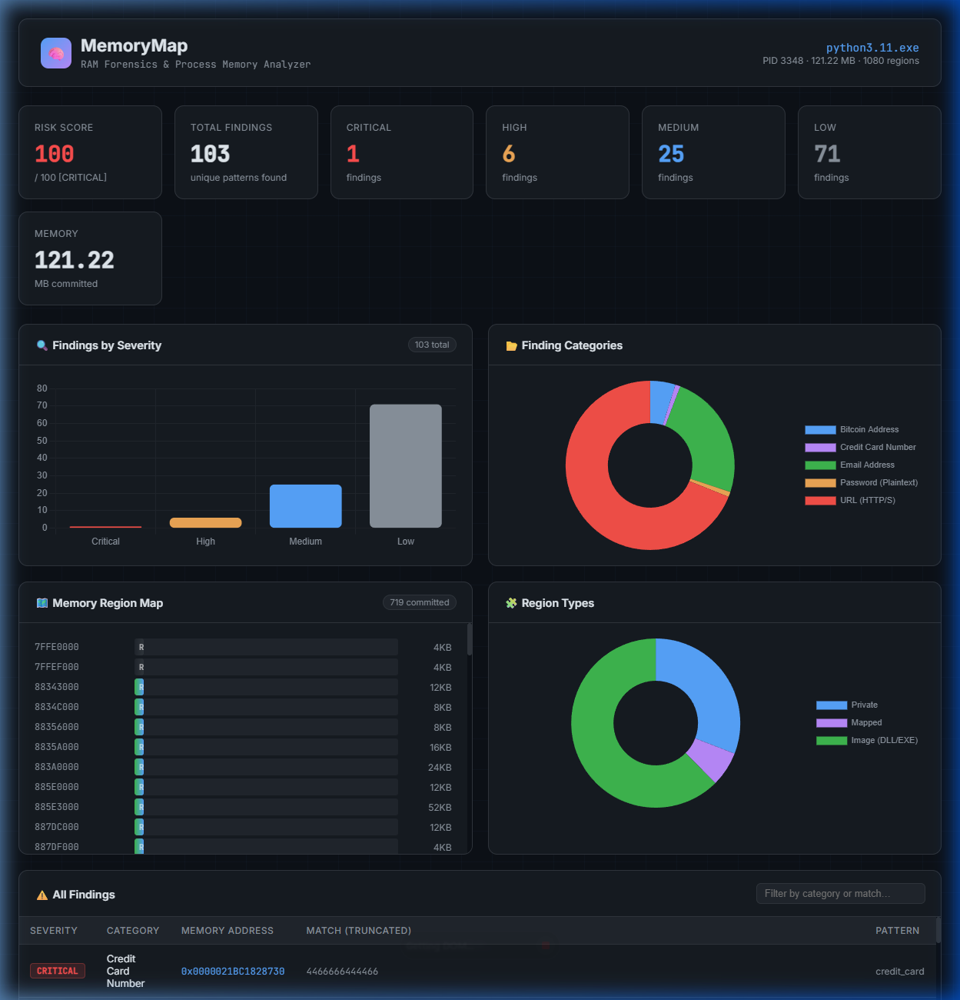

# MemoryMap 🧠

> **RAM Forensics & Process Memory Analyzer** — A Python tool that attaches to any running process, reads its virtual memory, hunts for secrets and sensitive data, detects behavioral anomalies, and generates a professional forensics report.

<p align="center">
  
  
  
  
</p>

## What is MemoryMap?

MemoryMap is a **live memory forensics tool** for Windows that:

1. **Reads virtual memory** — Enumerates all regions of a live process using the Windows API (`VirtualQueryEx`, `ReadProcessMemory`)
2. **Scans for secrets** — 20+ regex patterns detect API keys, JWTs, passwords, credit card numbers, emails, Bitcoin addresses, and more
3. **Detects anomalies** — 7 behavioral heuristics flag suspicious memory like injected PE files, shellcode staging areas, high-entropy payloads, and known malware strings
4. **Visualizes everything** — Interactive dark-mode web dashboard with Chart.js
5. **Exports a report** — Self-contained HTML forensics report you can print to PDF

## Demo

### Live Dashboard


*130 findings from python3.11.exe — Risk Score 100/100 CRITICAL*

### Anomaly Detection Panel


*PE injection indicators, high-entropy regions (7.7 bits/byte), shellcode string matches*

## Features

### 🔍 Secret Scanner
Detects sensitive data in raw memory using 20+ compiled regex patterns:

| Pattern | Severity |
|---------|---------|
| JWT Tokens | CRITICAL |
| PEM Private Keys | CRITICAL |
| AWS Access / Secret Keys | CRITICAL |
| Credit Card Numbers (Luhn) | CRITICAL |
| GitHub / Stripe / Slack Tokens | HIGH |
| Bitcoin & Ethereum Addresses | HIGH |
| Plaintext Passwords | HIGH |
| Email Addresses | MEDIUM |
| HTTP/S URLs | LOW |

### 🛡️ Anomaly Detector
7 behavioral heuristics that flag memory manipulation:

| Indicator | What it means |
|-----------|--------------|
| `PE_IN_PRIVATE` 💉 | MZ/PE header in private memory → Reflective DLL injection |
| `UNBACKED_EXEC` 👻 | Exec region with no file backing → Code injection |
| `RWX_REGION` 🔴 | Read + Write + Execute → Shellcode staging area |
| `HIGH_ENTROPY` 🔐 | Shannon entropy > 7.2 bits/byte → Encrypted payload |
| `SUSPICIOUS_STR` 🕷️ | Meterpreter, ReflectiveLoader, CreateRemoteThread etc. |
| `HEAP_EXEC` ⚠️ | Large executable heap region |
| `STACK_ANOMALY` 📚 | Executable stack → DEP bypass |

### 📊 Web Dashboard
- Risk score gauge (0–100)
- Findings by severity (bar chart)
- Category breakdown (donut chart)
- Region types (donut chart)
- Memory region visual map (color-coded bars)
- Filterable findings table
- Anomaly card grid with icons and memory addresses

### 📄 Report Generator
- Fully self-contained HTML report (~150 KB)
- Cover page with risk banner
- Executive summary with narrative + stats
- Complete findings table
- Anomaly cards + memory map
- 🖨️ Print / Save PDF button

## Installation

```bash
git clone https://github.com/GhaithKelil/memorymap.git
cd memorymap
pip install psutil pywin32 flask colorama tabulate
```

> ⚠️ **Windows only** — uses `ctypes` for direct Windows API calls

## Usage

### Interactive CLI
```bash
python cli.py
```

### Target a specific PID
```bash
python cli.py --pid 1234
```

### Web Dashboard
```bash
python ui/app.py --pid 1234
```
Then open **http://localhost:5000** in your browser.

> Run as **Administrator** for full access to system processes. Python/browser/node processes work without admin.

### Export Report
Click the **📄 Export Report** button in the dashboard header, or go to `http://localhost:5000/export`. Downloads a self-contained HTML file you can print to PDF.

## Project Structure

```
memorymap/
├── core/
│   ├── reader.py       # Windows memory API — VirtualQueryEx + ReadProcessMemory
│   ├── scanner.py      # 20+ regex secret patterns
│   ├── analyzer.py     # Risk scoring + report
│   └── anomaly.py      # 7-technique behavioral anomaly detector
├── ui/
│   ├── app.py          # Flask server + API endpoints
│   └── templates/
│       └── dashboard.html
├── reports/
│   └── generator.py    # Self-contained HTML report builder
├── cli.py
└── requirements.txt
```

## How It Works

```
Process (PID)
    │
    ▼
reader.py   →  VirtualQueryEx + ReadProcessMemory  →  raw bytes per region
    │
    ▼
scanner.py  →  20+ regex patterns  →  Finding list (category, severity, address)
    │
    ▼
anomaly.py  →  7 heuristics        →  Anomaly list (type, severity, detail)
    │
    ▼
analyzer.py →  risk score + grouping  →  AnalysisReport
    │
    ├──▶  ui/app.py          (web dashboard)
    └──▶  reports/generator  (HTML export)
```

## Risk Score

Scores use a logarithmic formula so one massive process with many LOW findings doesn't drown out a single CRITICAL hit:

```
raw   = Σ (severity_weight × count)
score = min(100, 50 × log10(raw + 1))
```

| Label | Score |
|-------|-------|
| CLEAN | 0 |
| LOW | 1–30 |
| MEDIUM | 31–60 |
| HIGH | 61–80 |
| CRITICAL | 81–100 |

## Real-World Results

Scanning **`python3.11.exe`** (a standard Python process) found:

- ✅ Credit card numbers in heap memory
- ✅ Bitcoin addresses in interpreter memory
- ✅ PE/MZ headers in private regions (C-extensions loaded reflectively)
- ✅ High entropy regions (7.7 bits/byte) — likely compressed bytecode
- ✅ Meterpreter & ReflectiveLoader strings from Python's `ssl` / `ctypes` modules

## Requirements

```
psutil>=5.9
pywin32>=305
flask>=3.0
colorama>=0.4
tabulate>=0.9
```

## License

MIT License — see [LICENSE](LICENSE) for details.
