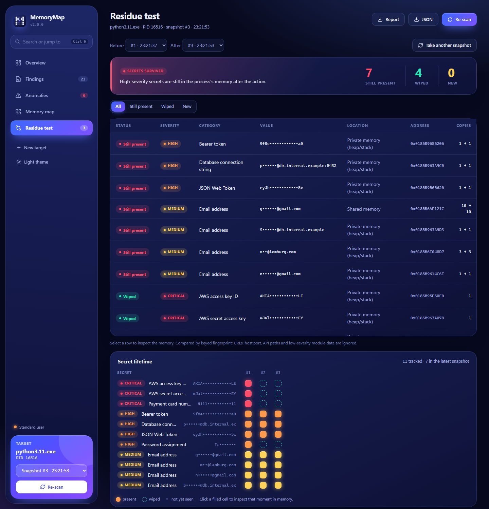
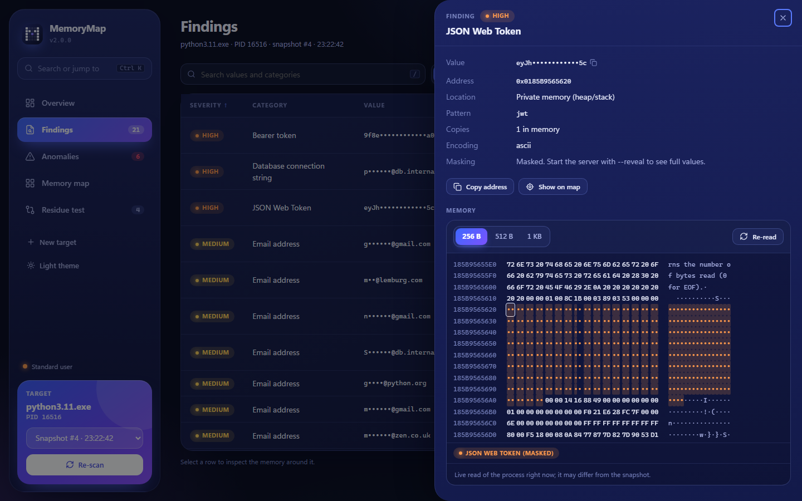
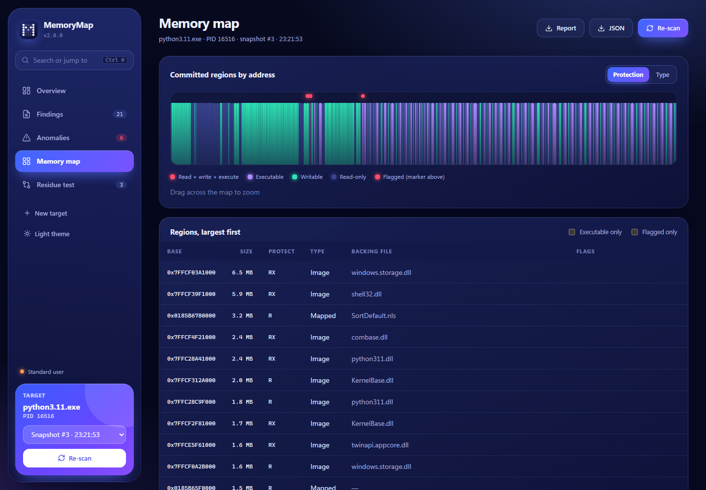

<p align="center">
  
</p>

Live process memory forensics for Windows, built around one question: **after your app is done with a secret, is it still in RAM?**

MemoryMap scans a running process for credentials and personal data, flags injection-style memory anomalies, and can compare two snapshots to show which secrets survived an action such as logging out, locking a vault or closing a session.



## Residue testing

Most memory tools answer "what is in this process right now?" MemoryMap's focus is what is *still there afterwards*, which is the question developers, pentesters and incident responders ask when they want to know whether an application cleans up after itself.

1. **Baseline.** Snapshot the process while the secret is in use (signed in, vault unlocked).
2. **Act.** Do the thing that should make the app forget: sign out, lock, close the document.
3. **Re-scan.** MemoryMap matches findings by fingerprint and reports each one as *still present*, *wiped* or *new*, with where it lives (heap or stack, module, mapped file) and how many copies existed before and after.

The verdict is one of `RESIDUE` (high-severity secrets survived), `MINOR`, `CLEAN`, or `INCONCLUSIVE` (the baseline held nothing to wipe, so the test proves nothing).

### From the command line

```
memorymap residue 4321 --action "myapp.exe --logout"
```

The command takes a baseline, runs your action, takes a second scan, prints the diff and exits non-zero if secrets survived, so it works as a regression test in CI:

| Exit code | Meaning |
|-----------|---------|
| 0 | Clean, or only low-severity data survived |
| 1 | Residue: high-severity secrets are still in memory |
| 3 | Inconclusive: the baseline contained nothing to wipe |

You can also do it in two steps and diff later:

```
memorymap snapshot 4321 -o before.json
# ...act...
memorymap snapshot 4321 -o after.json
memorymap diff before.json after.json
```

Snapshot files never contain plaintext secrets. Each finding is stored as a masked preview plus a keyed fingerprint (an HMAC under a per-machine key in `%LOCALAPPDATA%\memorymap\`), so a snapshot is not a second copy of what you are trying to protect. The consequence is that snapshots can be diffed on the machine that made them.

### In the dashboard

Scan a process, click **Re-scan** after your action, and open the **Residue test** tab. Besides the diff table, it draws a **secret lifetime matrix**: one row per secret, one column per snapshot, a filled cell where the secret was in memory and a dashed one where it was wiped. Click any filled cell to see that secret's bytes.

## Everything else it does

- **Secret scanner.** About 20 detectors for cloud keys, tokens, private keys, connection strings, passwords, payment cards and similar. Memory is reduced to ASCII and UTF-16LE strings, which matters because Windows stores most text as UTF-16. Candidates with a checksum or structure are validated before they are reported: Luhn for card numbers, base58check for Bitcoin addresses, JSON structure for JWTs.
- **Anomaly detector.** Five checks, each mapped to a MITRE ATT&CK technique, with signals corroborating each other inside a region (an unbacked executable region that also holds a PE image is escalated to critical):

  | Check | Looks for |
  |-------|-----------|
  | Writable and executable memory | RWX pages (T1055) |
  | Executable memory with no backing file | Injected or reflectively loaded code (T1055) |
  | PE image outside any loaded module | Manually mapped DLLs, validated through the NT header (T1620) |
  | High-entropy content | Packed or encrypted code (T1027) |
  | Offensive-tooling strings | Post-exploitation frameworks, or several injection API names together |

- **Dashboard.** Works offline, in light or dark, and is built to be investigated rather than read:
  - **Memory inspector.** Click any finding, anomaly or region to open a live hex dump of that memory, with the finding highlighted. Bytes belonging to *detected* secrets stay masked unless you start with `--reveal`; anything the scanner did not recognise, including a secret in an unusual format, shows as it is. It reads the process as it is now, so a wiped secret shows up as zeros.
  - **Linked memory map.** The map is address-ordered and coloured by protection, with flagged regions marked. Click a region to inspect it, drag across it to zoom, or use *Show on map* from any finding.
  - **Live scan feed.** Findings and anomalies stream in while a scan runs, and you can cancel at any point.
  - **Command palette.** `Ctrl K` jumps between sections, searches findings and anomalies, starts scans and runs commands. Tables are sortable.
  - **Deep links.** `#findings&inspect=<address>` opens the inspector on a finding.
- **Reports.** A self-contained HTML report (print it to PDF) and JSON export.






## Install

Windows 10 or later, Python 3.9 or later.

```
git clone https://github.com/GhaithKelil/memorymap.git
cd memorymap
pip install -e .
```

Run from an elevated terminal to inspect protected processes or other users' processes. If the `memorymap` command is not found (the Python `Scripts` folder is not always on `PATH`, notably with the Microsoft Store build), use `python -m memorymap` instead.

## Usage

```
memorymap                       open the dashboard
memorymap serve 4321            open it and scan PID 4321 (or a name like "chrome")
memorymap list -f chrome        find a process
memorymap scan 4321             terminal summary
memorymap scan 4321 --html report.html --json result.json
memorymap scan 4321 --fail-on high      exit 2 if anything high or above is found
memorymap residue 4321          interactive residue test
memorymap snapshot / diff       save snapshots and compare them later
```

### Try it safely

`examples/demo_target.py` is a harmless process that holds well-known example credentials (AWS documentation keys, a Visa test number, a sample JWT), plants an RWX page with a PE-like header, and "logs out" when told to, wiping four secrets and forgetting three. A correct residue test reports exactly that.

```
python examples/demo_target.py
memorymap serve <printed PID>
```

## Safe by default

- **Detected secrets are masked** everywhere (`AKIA••••••••••••LE`). Pass `--reveal` to show full values. The inspector's hex view also shows the raw bytes around a finding, and only recognised secrets are masked there.
- **The dashboard binds to localhost** and rejects requests addressed to any other hostname, which blocks DNS-rebinding. Binding elsewhere prints a warning.
- **Nothing is written to disk except what you ask for.** Dashboard snapshots live in memory, and the CLI writes only the files you name. The one exception is the fingerprint key (32 random bytes, created on first use in `%LOCALAPPDATA%\memorymap\`).
- Everything runs locally. There is no network access, telemetry or CDN dependency.

## Limits

- Findings describe what was in memory at scan time. They do not prove compromise, and executable unbacked memory is normal for JIT compilers and managed runtimes.
- Read-only file-backed pages (module code, mapped files) are skipped because they match what is on disk. Use `--include-images` to scan them.
- Memory that has been paged out, other processes, and the kernel are not covered. Scanning your own process includes the scanner's own strings.
- The diff ignores URLs, host:port and API paths, and low-severity data inside module images, which is static rather than runtime state.
- A wiped secret can still exist in a place the scan cannot see, such as the pagefile.
- Pattern matching produces some false positives, especially for emails and passwords. Treat the output as leads.
- Low and medium severity patterns (URLs, emails and similar) keep at most 2,000 distinct values each, so a process full of text cannot exhaust memory. When a pattern hits the cap the scan says so, and its counts are lower bounds. `--max-values` changes the limit. High and critical patterns keep scanning and store up to 20,000 distinct values each.
- Speed depends on how much text a process holds. On a deliberately hostile test process (617 MB, every line a unique email and URL, plus 300 MB of random bytes) a scan takes about a minute and the scanner stays under 60 MB. Real processes will differ, and text-heavy ones are the slow case.

## How it compares

[Volatility](https://github.com/volatilityfoundation/volatility3) and [MemProcFS](https://github.com/ufrisk/MemProcFS) analyse full memory dumps. [System Informer](https://systeminformer.sourceforge.io/) browses live process memory and strings. [PE-sieve](https://github.com/hasherezade/pe-sieve) and [Moneta](https://github.com/forrest-orr/moneta) are stronger at detecting injection. MemoryMap is not a replacement for any of them. It adds secret detection and the before-and-after residue workflow to a single live-scan tool.

## Project layout

```
memorymap/
  reader.py     Win32 memory access (VirtualQueryEx, ReadProcessMemory)
  scanner.py    string extraction, patterns, validators, masking, fingerprints
  anomaly.py    region checks and corroboration
  scan.py       the streaming scan pipeline
  diff.py       snapshots and the residue diff
  scoring.py    risk score
  report.py     HTML report
  cli.py        command line
  web/          Flask dashboard
examples/       demo target
design/         brand and illustration assets (SVG sources and the script that renders the PNGs)
tests/
```

## Development

```
pip install -e ".[dev]"
pytest
```

The live tests launch the demo target as a separate process and run a real residue test against it.

## License

MIT
